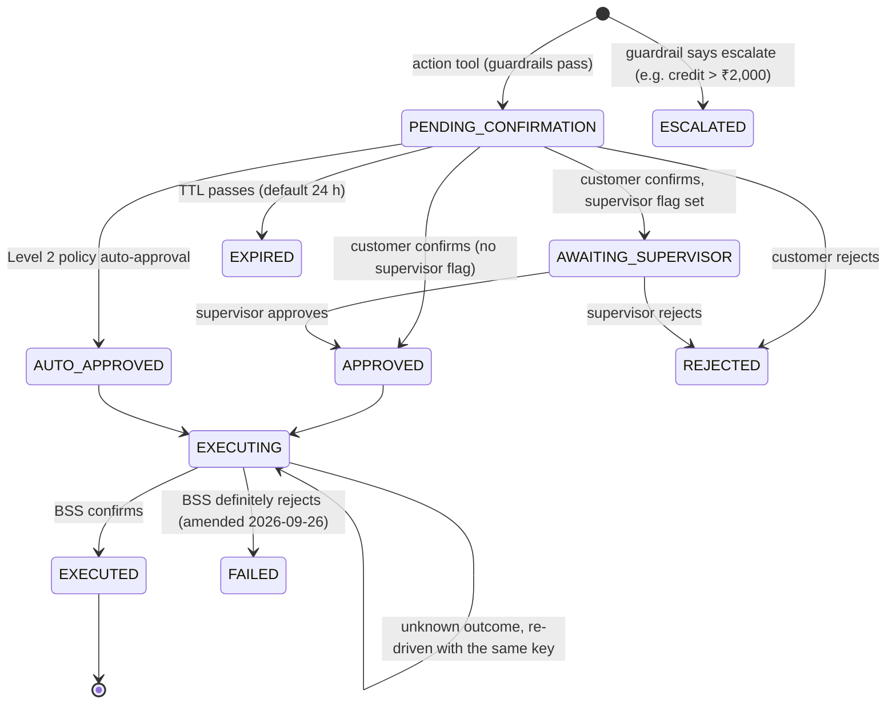

# ADR-004: Human-in-the-loop via ProposedAction and an autonomy ladder

| | |
|---|---|
| Status | Accepted (SPEC §4.3 rules 3–5, §4.5, §8.2) |
| Date | 2026-09-25 |
| Deciders | Repo owner |
| Related | [security.md](../security.md) §5 (LLM06 excessive agency), risks R-02, R-16, NFR-17, NFR-18, NFR-20 |

## Context

The agent can change a customer's account: credits, VAS unsubscribe with refund,
third-party barring, plan changes, add-ons, disputes. An LLM can be manipulated (R-03) or
simply wrong. Actions must be reversible where possible, confirmed by a human, and
auditable, and the business must be able to raise or lower autonomy without redeploying.

## Options

| Option | For | Against |
|---|---|---|
| A. Action tools execute directly, with guardrails | Fewest steps | One injected or mistaken tool call moves money |
| B. Actions only by care agents (no customer self-service) | Safest | Loses the containment benefit (PRD KPIs) |
| **C. Action tools only create a `ProposedAction`; execution only via the confirm endpoint or a policy auto-approval; autonomy level is a runtime flag** | Separates "the LLM suggests" from "a human or a written policy decides"; idempotent; auditable | More states and endpoints to build |

## Decision

**Option C.**

**State machine** (`proposed_action.status`):

- **Guardrail chain** (Chain of Responsibility, SPEC §4.2) runs when a proposal is created
  and again at confirm time, because the data may have changed. Thresholds come from
  config and are never shown to the LLM (SPEC §4.5).
- **Idempotency:** `POST /actions/{id}/confirm` requires an `Idempotency-Key` header. The
  key, a hash of the request and the stored response live in `idempotency_record`; a
  replay returns the stored response. The executor also passes a deterministic external
  reference (`action_id`) to the BSS (TMF622/TMF621) so that the BSS can deduplicate too.
  The status transition uses optimistic locking (`version` column), so two concurrent
  confirms cannot both move `APPROVED → EXECUTING`.
- **Audit:** proposal, each guardrail decision, confirm/reject, execution and result are
  written as `audit_events` rows **in the same transaction** as the state change (NFR-18).
- **Autonomy ladder** (SPEC §8.2) as runtime flags (`feature_flag` table, pushed via Redis
  pub/sub, 5 s maximum staleness; scalability.md §6):
  - Level 0: action tools are **not registered** with the ChatClient, so the LLM cannot
    call them. Explanations only.
  - Level 1: tools register; every action needs customer confirmation (the MVP slice
    fixes Level 1 through config, per plan-and-budget §2a).
  - Level 2: the auto-approval policy (credit ≤ 15% of bill AND ≤ ₹500 AND no credit in 6
    months) may move `PENDING_CONFIRMATION → AUTO_APPROVED`.
  - The kill switch lowers the level instantly. In-flight `PENDING_CONFIRMATION` actions
    stay confirmable by a human; `AUTO_APPROVED` stops being issued (NFR-20).
- **Care-agent assisted mode** (A-40): a care agent may confirm on the customer's behalf
  only with a recorded verbal-consent flag, which is audited.

**Amendment (2026-09-26, Phase 6a owner decisions; details in
[actions.md](../../03-development/actions.md) §2, §6):**
- Only a **definite** BSS rejection moves `EXECUTING → FAILED`. A timeout, connection error
  or unknown result leaves the action `EXECUTING`, because the effect may have been applied.
  Re-driving with the same BSS key `pa-{actionId}` is safe; a reconcile job (6b) re-drives
  `EXECUTING` actions and never fails them automatically.
- `ESCALATED` actions open their TMF621 ticket immediately, without customer confirmation
  (a hand-off is not an account change), deduplicated per conversation.
- At most one live action per target (`target_ref`), so two proposals of the same refund
  can never both execute.

## Consequences

- Positive: an injected prompt can at most create a proposal that a human sees and can
  reject. Money never moves on the LLM's say-so alone.
- Positive: Level 0 launch (A-41) is a config value, not a code path.
- Negative: an extra customer step for every action at Level 1. Containment will be
  lower than full autonomy (A-38 sensitivity covers this).
- Negative: `FAILED` actions need an operational process (runbook "wrong or excessive
  credits", Phase 12). There is no automatic retry, to avoid double effects.
