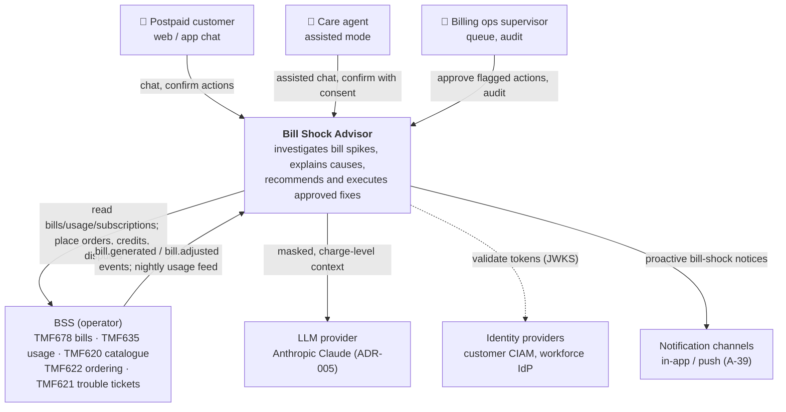
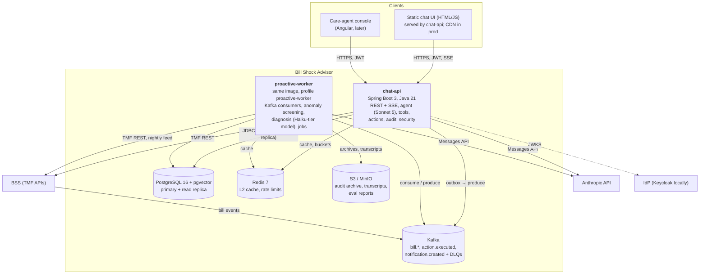
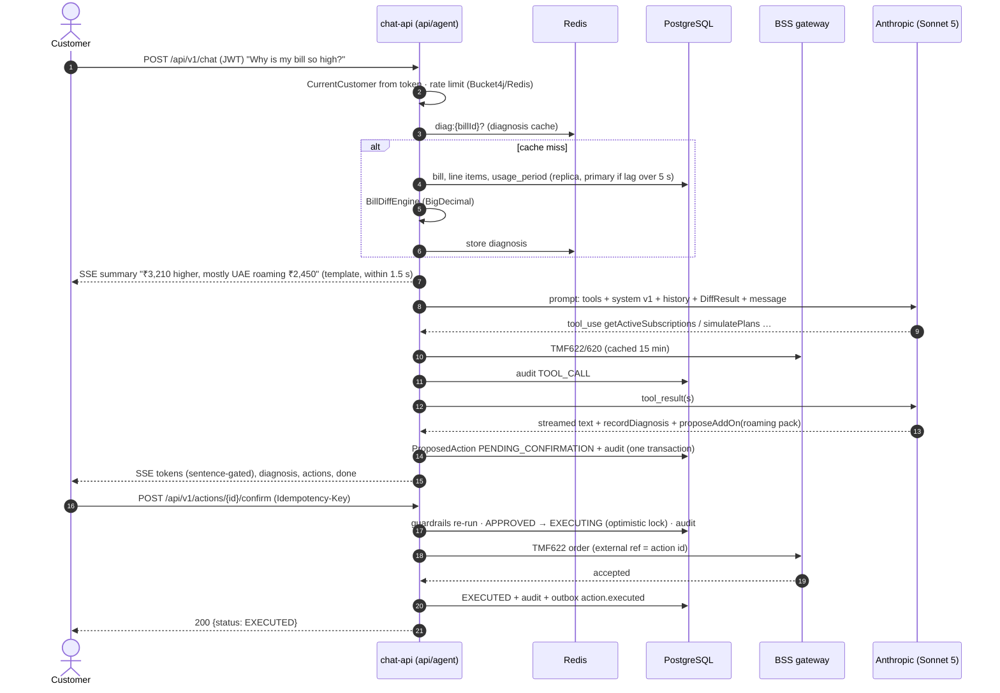
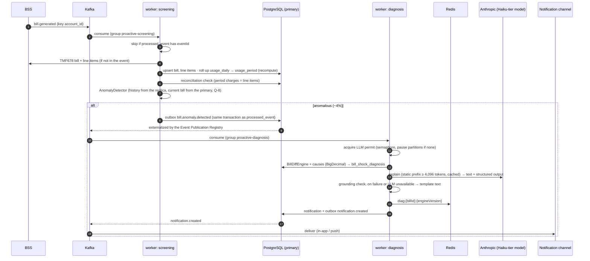
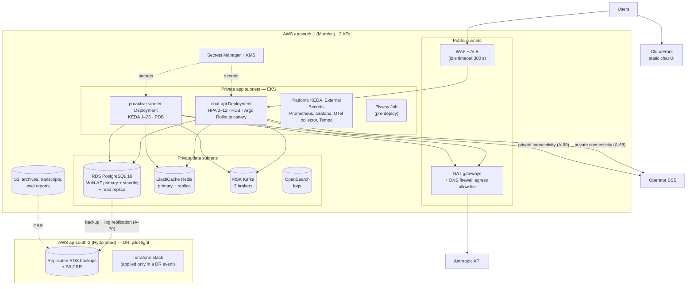

# System Architecture

| | |
|---|---|
| Status | Draft for review (Phase 2) |
| Date | 2026-09-25 |
| Spec reference | SPEC.md §2.1, §3, §4.1, §4.2, §4.7 |
| Decisions | [ADR-001](adr/001-modular-monolith-two-deployables.md) · [ADR-002](adr/002-postgresql-system-of-record.md) · [ADR-003](adr/003-llm-never-does-arithmetic.md) · [ADR-004](adr/004-hitl-proposed-action-autonomy-ladder.md) · [ADR-005](adr/005-llm-provider-fallback-data-residency.md) (pending owner) · [ADR-006](adr/006-kafka-vs-application-events.md) · [ADR-007](adr/007-usage-storage-layout-late-usage.md) |
| Related | [data-architecture.md](data-architecture.md) · [scalability.md](scalability.md) · [security.md](security.md) · [llm-architecture.md](llm-architecture.md) · [observability.md](observability.md) · [nfr.md](nfr.md) |

Diagrams are Mermaid **flowcharts in C4 style** (A-65), because Mermaid's native C4 syntax
is experimental and renders unreliably.

---

## 1. Architecture at a glance

- **One codebase, two deployables** (ADR-001): `chat-api` (latency-sensitive: chat over
  SSE, REST, actions) and `proactive-worker` (throughput-sensitive: Kafka consumers for bill
  events, scheduled jobs). Both run from one image, and the role is chosen by Spring
  profile (A-59).
- **Deterministic core, LLM at the edge** (ADR-003): Java engines compute every amount;
  the LLM selects tools and explains.
- **Human in the loop** (ADR-004): action tools only propose; execution needs confirmation
  or a written auto-approval policy; autonomy is a runtime flag.
- **PostgreSQL is the system of record** for what we own (ADR-002); BSS remains the system
  of record for billing and usage; usage is stored as bill-period aggregates plus 3 months
  of daily rows (ADR-007).
- **Events through the outbox** (ADR-006): in-process locally, Kafka in staging/prod.

## 2. C4 level 1: system context



## 3. C4 level 2: containers



## 4. Modules (Spring Modulith; SPEC §4.1)

| Module | Responsibility | Patterns (SPEC §4.2) | May depend on | Active in |
|---|---|---|---|---|
| `domain` | Shared kernel: value objects (`Money`, `BillPeriod`, `AccountId`), entities, `BillShockDiagnosis` | — | — (open module) | both |
| `security` | Resource server config, `CurrentCustomer`, PII masking/scrubbing | — | `domain` | both |
| `audit` | Append-only audit API and store; daily digest | — | `domain` | both |
| `bss` | Gateway interfaces + mock/real adapters (TMF678/635/620/622/621); ingest (bills, usage feed, batch ledger, roll-up, reconciliation); read models for bills and usage | Adapter/Gateway | `domain`, `audit` | both |
| `analysis` | `BillDiffEngine`, `AnomalyDetector` (Strategy per rule), `PlanSimulator`; diagnosis store and cache | Strategy | `domain`, `bss` | both |
| `policy` | RAG ingestion and retrieval | — | `domain` | chat-api (ingest: admin) |
| `actions` | ProposedAction workflow, guardrail chain, executors, idempotency, autonomy flags | Chain of Responsibility, Strategy (executors) | `domain`, `bss`, `audit`, `security` | chat-api |
| `tools` | `@Tool` classes: Billing, Usage, Catalog, Action, Policy | — | `domain`, `analysis`, `bss`, `actions`, `policy`, `security`, `audit` | chat-api |
| `agent` | ChatClient beans, prompts, orchestration, grounding gates, memory, fallback templates, cost metering | Template Method (fallback) | `domain`, `tools`, `analysis`, `security`, `audit` | both (proactive explanation service) |
| `proactive` | Kafka consumers, screening, diagnosis orchestration, notifications, jobs | Idempotent Consumer | `domain`, `analysis`, `agent`, `bss`, `audit` | proactive-worker |
| `api` | REST controllers, SSE, DTOs, Problem Details | — | `agent`, `actions`, `analysis`, `proactive` (notification queries), `audit` (query), `security`, `domain` | chat-api |

- Dependencies are allowed only on another module's **published API package** (Modulith
  named interfaces). Everything else is internal. `ApplicationModules.verify()` runs in
  `./mvnw verify` and fails the build on violations or cycles (SPEC §4.1).
- **Transactional Outbox** is the Modulith Event Publication Registry (ADR-006).
- The table has no cycles (for example `agent → tools → actions`, and `proactive → agent`,
  never the reverse).

## 5. Event catalogue

| Event (topic) | Produced by | Payload (no names, no free text) | Consumed by |
|---|---|---|---|
| `bill.generated` | BSS integration adapter (bridges TMF678 notifications; the admin simulate endpoint locally) | `eventId, accountId, billId, billPeriod, billDate, total` | `proactive` screening |
| `bill.adjusted` (A-62) | BSS integration adapter | `eventId, accountId, billId, billPeriod, adjustmentId` | `proactive` (refresh + re-roll-up), cache eviction |
| `bill.anomaly.detected` | `proactive` screening (outbox) | `eventId, accountId, billId, billPeriod, anomalyScore, rulesFired[]` | `proactive` diagnosis |
| `notification.created` | `proactive` (outbox) | `eventId, accountId, notificationId, billId, type` | Notification delivery adapter |
| `action.executed` | `actions` (outbox) | `eventId, accountId, actionId, type, amount, status` | cache eviction, analytics |

Details (partitions, retries, DLQs): scalability.md §3.

## 6. Chat flow (sequence)

The LLM-side detail (caching, gates, budgets) is in llm-architecture.md §4. This diagram
shows the flow across containers, including a confirmation.



## 7. Proactive flow (sequence)



When the customer then opens chat, the diagnosis is already in Redis/DB, so the pre-fetch
is a cache hit (scalability.md §6).

## 8. Deployment (production reference: AWS ap-south-1, A-58)



**Environments** (SPEC §6): `local` (docker compose; one process with both profiles;
in-process events; mock BSS; Ollama or Anthropic), `dev`, `qa`, `staging` (same topology
as prod at a smaller size; synthetic data only; eval gate), `prod`. Configuration comes
from Spring profiles plus Helm values per environment.

## 9. Traceability: SPEC requirement → where it is designed

| SPEC | Design |
|---|---|
| 2.1 two deployables, ADRs, diagrams | This document, ADR-001…007 |
| 2.2 data architecture | data-architecture.md, ADR-002, ADR-007 |
| 2.3 scaling, caching, Kafka, backpressure, rate limits | scalability.md |
| 2.4 NFRs | nfr.md (SLIs in observability.md §1) |
| 2.5 security, DPDP, residency | security.md, ADR-005 |
| 2.6 LLM architecture | llm-architecture.md, ADR-005 |
| 2.7 observability | observability.md |
| 4.3 agent rules | ADR-003 (1), security.md §2 (2), ADR-004 (3–5), llm-architecture.md §7 (6) |

## 10. Known limitations and future enhancements

| Item | Status |
|---|---|
| **Real-time usage events** (A-63): local usage is at best up to the previous day, so **in-trip real-time bill-shock alerts are not possible in v1** | Future enhancement: consume a streaming usage feed or BSS usage-threshold notifications (for example roaming-spend thresholds) into a new `usage.threshold.crossed` topic, and alert during the trip |
| Care-agent console | v1 has the static chat page. **Angular upgrade path:** a separate SPA (same REST/SSE API, the same OIDC IdP with the workforce realm) with an assisted-session picker, a supervisor queue and an audit viewer. The API is already role-scoped, so no backend change is needed beyond the queue endpoints (6b) |
| Hindi and other languages | Templates and prompts are locale-ready (llm-architecture.md §10) |
| Cross-provider LLM failover | Not in v1 (ADR-005); template fallback instead |
| Sharding | Path documented; not needed for 10x (data-architecture.md §8) |
| Multi-line / family accounts | Out of scope (A-67) |

## 11. API addition: stream recovery (decision Q-16; implement in 5b, not in the MVP slice)

Extends SPEC §4.7. Purpose: when an SSE stream drops (mobile network, proxy timeout), the UI
can recover the finished turn **without starting a second turn**, which would repeat tool
calls and LLM cost (scalability.md §2).

**1. `POST /api/v1/chat` gains `clientMessageId`**

```json
{ "conversationId": "0192f7c4-…", "clientMessageId": "8d1e2f60-…", "message": "Why is my bill so high?" }
```

- `clientMessageId`: UUID generated by the client per user message. Optional until 5b ships,
  then required for the web UI.
- Stored on the user's `chat_messages` row with a unique constraint on
  `(conversation_id, conversation_month, client_message_id)` (partition key included,
  data-architecture.md §4.6).
- Same id again:
  - turn **completed** → the stored result is replayed as SSE (`summary`, the final text,
    `diagnosis`, `actions`, `done`). No LLM call, no tool call, not counted against the
    per-customer rate limit;
  - turn **still running** → `409 Conflict`, Problem Details `type: …/turn-in-progress`,
    `Retry-After: 2`. The client then polls endpoint 2;
  - same id with a **different message text** → `422`, `type: …/client-message-id-reuse`.

**2. `GET /api/v1/chat/{conversationId}/messages`**

| Aspect | Design |
|---|---|
| Auth | CUSTOMER (own conversation) or CARE_AGENT (assisted account). The conversation's `account_id` must equal `CurrentCustomer`, otherwise `404` (not 403, so conversation ids don't leak) |
| Query | `after` (message `seq`, exclusive; default 0), `limit` (default 50, max 100) |
| Response `200` | `{ "conversationId", "turnInProgress": bool, "messages": [ { "seq", "role": "USER" \| "ASSISTANT", "clientMessageId", "text", "createdAt", "diagnosis"?, "actions"? } ], "nextAfter" }` |
| Content | Only USER and ASSISTANT messages, as shown to the customer: the **scrubbed** user text and the **released** (grounding-gated) assistant text. Tool calls, tool results and system context are never returned |
| Pagination | Keyset on `seq` (SPEC §4.7 pagination rule); `nextAfter` is null on the last page |
| Errors | RFC 7807 Problem Details: 401, 404, 429 |
| Rate limit | 60 per minute per customer (reads; scalability.md §5) |
| Index | PK `(conversation_id, conversation_month, seq)`, one partition via the UUIDv7 (plan Q5 in data-architecture.md §7) |
