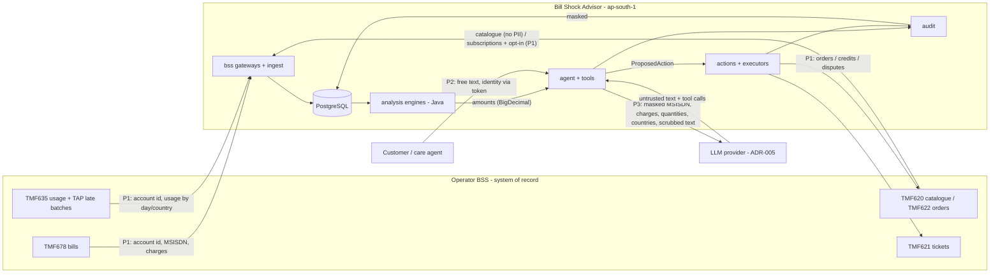

# Data Architecture

| | |
|---|---|
| Status | Draft for review (Phase 2) |
| Date | 2026-09-25 |
| Spec reference | SPEC.md §2.2, §2.3, §4.3, §4.10 |
| Related | ADR-002, ADR-007, [security.md](security.md), [scalability.md](scalability.md), [../01-requirements/capacity-estimates.md](../01-requirements/capacity-estimates.md) §5.4 |

**Principles**
- PostgreSQL 16 + pgvector is the system of record for what the application owns
  (ADR-002). BSS is the system of record for billing, usage and subscriptions. Our copies
  are **read models** with fixed retention.
- **Money is `NUMERIC(14,2)`, never float** (SPEC §2.2). Quantities are `NUMERIC(14,3)` or
  `integer`. LLM cost metering uses `NUMERIC(14,6)` USD, because a single call costs
  fractions of a cent. That is internal metering, never customer money.
- Every customer-owned row carries `account_id`. It is the authorisation key (security.md
  §2) and the future shard key (§8).
- Usage layout is **option C** (A-56, ADR-007): bill-period aggregates for 7 months, daily
  rows for 3 billing months, per-session detail from BSS on demand.

---

## 1. Entity-relationship diagram

```mermaid
erDiagram
    ACCOUNT ||--o{ BILL : "billed as"
    BILL ||--|{ BILL_LINE_ITEM : contains
    ACCOUNT ||--o{ USAGE_PERIOD : "aggregated as"
    USAGE_PERIOD ||--o{ USAGE_PERIOD_ROAMING : "split by country"
    ACCOUNT ||--o{ USAGE_DAILY : "daily (3 months)"
    USAGE_DAILY ||--o{ USAGE_DAILY_ROAMING : "split by country"
    USAGE_INGEST_BATCH ||--o{ USAGE_DAILY : "loaded by"
    BILL ||--o{ BILL_SHOCK_DIAGNOSIS : "diagnosed as"
    BILL_SHOCK_DIAGNOSIS ||--o{ NOTIFICATION : "announced by"
    ACCOUNT ||--o{ CONVERSATION : has
    CONVERSATION ||--|{ CHAT_MESSAGES : contains
    CONVERSATION ||--o{ LLM_CALL_LOG : "metered by"
    CONVERSATION ||--o{ PROPOSED_ACTION : proposes
    ACCOUNT ||--o{ PROPOSED_ACTION : "acts on"
    PROPOSED_ACTION ||--o| IDEMPOTENCY_RECORD : "confirmed with"
    ACCOUNT ||--o{ AUDIT_EVENTS : "audited in"
    CONVERSATION ||--o{ FEEDBACK : rated
    PLAN ||--|{ TARIFF_RATE : "rated by"
    POLICY_DOCUMENT ||--|{ POLICY_CHUNK : "embedded as"

    ACCOUNT { bigint account_id PK "text msisdn (PII) · smallint bill_cycle_day · text status" }
    BILL { date bill_period PK "bigint bill_id PK · bigint account_id · numeric total" }
    BILL_LINE_ITEM { date bill_period PK "bigint line_item_id PK · bigint bill_id FK · text category · date usage_period · numeric amount" }
    USAGE_PERIOD { bigint account_id PK "date billed_period PK · date usage_period PK · wide usage columns" }
    USAGE_DAILY { bigint account_id PK "date billed_period PK · date usage_date PK · bigint source_batch_id PK" }
    PROPOSED_ACTION { bigint action_id PK "bigint account_id · text action_type · text status · numeric amount · int version" }
    AUDIT_EVENTS { timestamptz occurred_at PK "bigint audit_id PK · bigint account_id · uuid conversation_id · jsonb payload" }
    CHAT_MESSAGES { date conversation_month PK "uuid conversation_id PK · int seq PK · bigint account_id · text content" }
```



Subscriptions, add-on activations and VAS opt-in records are **not stored**. They are
fetched from BSS (TMF622/TMF620) on demand and cached for 15 minutes. The product catalogue
(plans, add-ons, tariff rates) **is** replicated locally, because `PlanSimulator` needs it
on every simulation. It is refreshed daily from TMF620 and cached in L1 (Caffeine).

## 2. Table list

Rows at 1x are steady state. The module is the Spring Modulith owner (architecture.md §4).

| Table | Module | Purpose | Primary key | Partitioned by | Retention | PII | Rows at 1x |
|---|---|---|---|---|---|---|---|
| `account` | `bss` | Local account reference (cycle day, GST state, MSISDN for BSS calls) | `account_id` | — | While active + 7 months | MSISDN | 10 M |
| `plan`, `add_on`, `tariff_rate` | `bss` | Catalogue replica (TMF620) | `plan_id` / `add_on_id` / `(plan_id, usage_type, band)` | — | Versioned (`valid_from/to`) | — | < 10 k |
| `bill` | `bss` | Bill headers (TMF678 replica) | `(bill_period, bill_id)`, unique `(account_id, bill_period)` | `bill_period`, monthly | 7 partitions | Personal | 70 M |
| `bill_line_item` | `bss` | Line items, incl. `usage_period` for late charges | `(bill_period, line_item_id)` | `bill_period`, monthly | 7 partitions | Personal | 1.05 B |
| `usage_period` | `bss` | Bill-period wide aggregates (ADR-007) | `(account_id, billed_period, usage_period)` | `billed_period`, monthly | 7 partitions | Personal | 70 M |
| `usage_period_roaming` | `bss` | Period roaming by country | `(account_id, billed_period, usage_period, country_code)` | `billed_period`, monthly | 7 partitions | Personal (location) | 1.7 M |
| `usage_daily` | `bss` | Daily wide rows | `(account_id, billed_period, usage_date, source_batch_id)` | `billed_period`, monthly | **3 partitions** (A-60) | Personal | ≤ 0.9 B |
| `usage_daily_roaming` | `bss` | Daily roaming by country | `(account_id, billed_period, usage_date, country_code, source_batch_id)` | `billed_period`, monthly | 3 partitions | Personal (location) | ≤ 5 M |
| `usage_ingest_batch` | `bss` | Batch ledger for idempotent ingest | `batch_id` | — | 13 months | — | ~2 k/month |
| `usage_reconciliation_issue` | `bss` | Roll-up vs line-item mismatches | `issue_id` | — | 13 months | — | small |
| `bill_shock_diagnosis` | `analysis` | Engine result + LLM explanation, reused by chat and proactive | `diagnosis_id`, unique `(bill_id, engine_version)` | — (small) | 7 months | Personal | ~400 k/month |
| `notification`, `notification_preference` | `proactive` | Proactive outreach and opt-out | `notification_id`, unique `(bill_id, type)` / `account_id` | — | 7 months | Personal | ~400 k/month |
| `conversation` | `agent` | Conversation metadata: account, channel, prompt version, model, cost | `conversation_id` (UUIDv7) | — | 13 months | Pseudonymous | 320 k/month |
| `chat_messages` | `agent` | Chat memory (scrubbed text) | `(conversation_id, conversation_month, seq)` | `conversation_month`, monthly | 90 days hot (4 partitions), then transcript archive to S3 for 1 year | Personal (free text, scrubbed) | 23 M |
| `llm_call_log` | `agent` | Per-call tokens, cache fields, cost, latency, request id | `(called_month, call_id)` | `called_month`, monthly | 13 months | — | 6.2 M/month |
| `bill_diagnosis` | `agent` | Structured diagnosis per conversation and bill; money from the engine (Phase 5a, Q-35) | `diagnosis_id` (UUIDv7) | — (A-103) | 7 months (§10) | Pseudonymous (account id, no free text except recommendation summaries that passed the grounding gate) | ≈ 320 k/month |
| `proposed_action` | `actions` | ProposedAction state machine (ADR-004) | `action_id`, unique `idempotency_key` | — | 7 years (**FOR LEGAL REVIEW**) | Personal | ~160 k/month (0.5 per conversation) |
| `idempotency_record` | `actions` | Stored confirm/reject responses per `Idempotency-Key` | `(account_id, idempotency_key)` | — | 30 days | — | small |
| `audit_events` | `audit` | Immutable audit (SPEC §4.3 rule 5) | `(occurred_at, audit_id)` | `occurred_at`, monthly | 13 months hot, then S3 archive, 7 years total (**FOR LEGAL REVIEW**) | Masked payloads | 21 M/month |
| `feedback` | `api` | Thumbs up/down + comment | `feedback_id` | — | 13 months | Free text (scrubbed) | small |
| `event_publication` | Modulith | Outbox / Event Publication Registry (ADR-006) | `id` | — | Completed rows purged after 7 days | — | transient |
| `processed_event` | shared | Idempotent consumer (`consumer`, `event_id`) | `(consumer, event_id)` | — | 14 days | — | transient |
| `feature_flag` | `actions` | Autonomy level, kill switches, LLM mode (runtime, audited) | `flag_key` | — | — | — | < 100 |
| `policy_document`, `policy_chunk` | `policy` | RAG source and embeddings (`vector(384)`, HNSW) | `doc_id` / `chunk_id` | — | Versioned | — | < 10 k |

## 3. Column conventions

- Money: `NUMERIC(14,2)`, with `CHECK` constraints where the sign is known (credits ≥ 0).
- Periods: `bill_period`, `billed_period`, `usage_period` are `date`, always the first day
  of the **billing month** (the month of the bill date). There is exactly one bill per
  account per billing month (A-02: one bill cycle per account).
- Time: `timestamptz` in UTC. Display in IST is the UI's job.
- Ids: `bigint` from BSS for bills and line items; UUIDv7 for `conversation_id` (time
  ordered, and it carries the partition month); `bigint` identity for internal tables.
- Optimistic locking: `version integer` on `proposed_action`.
- Free text from customers is stored only in scrubbed form (security.md §6).

## 4. Key tables in detail

### 4.1 `account`, `bill` and `bill_line_item`
*(Updated in Phase 3a with the approved schema changes from
[seed-scenarios.md](../03-development/seed-scenarios.md) §8. The GST model is A-72.)*

- `account`: `account_id, msisdn, bill_cycle_day, gst_state_code char(2)` (place of
  supply: the GST state code of the billing address), `status, created_at`.
- `bill`: `bill_id, account_id, bill_period, period_start, period_end, bill_date,
  place_of_supply char(2), supply_type (INTRA | INTER), subtotal, tax_total, total,
  status, source_version, generated_at`. `place_of_supply` and `supply_type` are a
  snapshot, because the account's state can change later.
- **GST is computed at bill level** (A-72): tax on `subtotal`. Intra-state: two `TAX` lines,
  CGST 9% + SGST 9%. Inter-state: one `TAX` line, IGST 18%. Each component is rounded
  HALF_EVEN to 2 dp. Checks enforced at ingest (and by CHECK constraints where they are
  row-local): `total = subtotal + tax_total`; `subtotal` = Σ non-tax lines; `tax_total` =
  Σ TAX lines.
- `bill_line_item`: `line_item_id, bill_id, bill_period, account_id, category`
  (`RENTAL | DATA | VOICE | SMS | ROAMING | VAS | PRORATION | ADJUSTMENT | TAX | CREDIT |
  OTHER`), `description` (untrusted text, security.md §5), `usage_period` (set when the
  charge is for an earlier cycle: late roaming, ADR-007), `service_period_start`,
  `service_period_end` (nullable; needed for proration and duplicate detection),
  `subscription_id`, `quantity`, `unit`, `amount`, `tax_component (CGST | SGST | IGST)`
  and `tax_rate numeric(5,2)` (set on TAX lines only, and required there by a CHECK),
  `external_ref`. **There is no per-line `tax_amount`**, because tax is bill-level.
- Line items are **authoritative for money**. Usage aggregates explain quantities
  (ADR-007 §6).
- Config: `billshock.tax.supplier-state-codes` (the states in which the operator holds a GST
  registration; seed: `[27]`, A-73), `billshock.tax.gst-rate=18.00`. A bill is intra-state
  when its place of supply is in that list.

### 4.2 Catalogue
`plan (plan_id, code, name, monthly_rental, valid_from, valid_to, attributes jsonb)`,
`tariff_rate (plan_id, usage_type, band, included_units, unit_price, unit, day_based)`,
`add_on (add_on_id, code, name, price, data_mb, voice_min, sms_count, validity,
validity_days, country_group, valid_from, valid_to)`. The `day_based` flag marks tariffs
that `PlanSimulator` can re-rate only with daily data (A-55).
- *(Phase 3a, as built in V1)*: `included_units NULL` means unlimited. `unit_price` is a
  rate (₹ per unit), not an amount, so it is `NUMERIC(14,4)`; every charge computed from it
  is rounded to `NUMERIC(14,2)`. Add-ons bundle several allowances (a roaming pack has
  data, voice and SMS), so their contents are wide columns instead of one
  `usage_type`/`units` pair. `validity` is `DAYS` (with `validity_days`) or `BILL_CYCLE`.
**A-61:** the v1 catalogue has no time-of-day tariffs.

### 4.3 Usage (option C, ADR-007)
- Wide columns in `usage_daily` and `usage_period`: `data_mb, data_charge, voice_min,
  isd_min, voice_charge, sms_count, sms_charge, roaming_data_mb, roaming_voice_min,
  roaming_sms_count, roaming_charge`. `voice_min` is domestic minutes only; `isd_min`
  holds international minutes, so the simulator can re-rate ISD against each plan's
  allowance; `voice_charge` is all VOICE line items (Q-28, A-89; added in 4a). `usage_period` adds `source_row_count, rolled_up_at`.
  `usage_daily` adds `usage_period` (the cycle the usage belongs to).
- Roaming tables: `country_code char(2)`, `first_day`, `last_day`, quantities, `charge`.
- `usage_ingest_batch (batch_id, source, checksum, status, row_count, received_at,
  loaded_at)`. Statuses: `RECEIVED | LOADED | REJECTED | QUARANTINED`.
- View `usage_as_used`: Σ of period rows grouped by `(account_id, usage_period)`
  (ADR-007 §7).
- **A-63 limitation (accepted):** the usage feed is a nightly batch, so local usage is at
  best **up to the previous day**. **In-trip real-time alerts are not possible in v1.**
  Real-time usage events (for example a streaming usage feed or the BSS usage-threshold
  notifications) are listed as a **future enhancement** in architecture.md §10. Chat about
  today's usage says the data is up to yesterday and, if needed, fetches detail from BSS
  on demand (A-25).

### 4.4 Actions and idempotency
- `proposed_action`: `action_id, account_id, conversation_id, action_type, status,
  amount, currency, params jsonb, guardrail_result jsonb, requires_supervisor,
  idempotency_key, expires_at, decided_by, decided_at, executed_at, external_ref,
  failure_reason, version, created_at`.
- `idempotency_record`: `(account_id, idempotency_key)`, `request_hash`, `response_status`,
  `response_body jsonb`, `created_at`. A repeat with the same key and hash returns the
  stored response; the same key with a different hash → 422 Problem Details.

### 4.5 Audit
`audit_events`: `audit_id, occurred_at, account_id, conversation_id, correlation_id,
actor_type (CUSTOMER|CARE_AGENT|SUPERVISOR|ADMIN|AGENT|SYSTEM), actor_ref (masked),
event_type, tool_name, action_id, prompt_version, payload jsonb (masked), result_hash`.

### 4.6 Chat
- `conversation`: `conversation_id (UUIDv7), account_id, channel, started_at, locale,
  prompt_version, model, autonomy_level, llm_cost_usd NUMERIC(14,6), status`.
- `chat_messages`: `conversation_month, conversation_id, seq, account_id, role
  (USER|ASSISTANT|TOOL|SYSTEM_CONTEXT), content (scrubbed), tool_name, token_count,
  client_message_id (5b; unique per conversation, Q-16), created_at`. The custom `ChatMemoryRepository` derives `conversation_month` from the
  UUIDv7 (llm-architecture.md §8). `account_id` is present for authorisation, erasure
  requests and sharding.
- `llm_call_log`: `call_id, called_month, conversation_id (nullable for proactive),
  model, prompt_version, input_tokens, cache_write_tokens, cache_read_tokens,
  output_tokens, cost_usd NUMERIC(14,6), latency_ms, provider_request_id, outcome`.
- `bill_diagnosis` (Phase 5a, Q-35): `diagnosis_id, conversation_id, account_id,
  bill_period, verdict, total_excess NUMERIC(14,2), causes jsonb, confidence,
  recommended_actions jsonb, source (LLM|ENGINE), prompt_version, created_at`. Not
  partitioned (A-103). Indexes: `(account_id, bill_period DESC, created_at DESC)` for the
  latest diagnosis of a bill (6a endpoint), `(created_at)` for the retention delete.

## 5. Partitioning

Native declarative range partitioning, monthly (SPEC §2.2). SPEC §2.2 names
`usage_records`; under option C its place is taken by the four usage tables below (SPEC
updated in Phase 2).

| Table | Partition key | Why this key | Partitions kept | Retention action |
|---|---|---|---|---|
| `usage_daily`, `usage_daily_roaming` | `billed_period` | All reads start from a bill; late records always land in the open partition (ADR-007 §3) | 3 (open + 2) | `DROP` (BSS keeps the source) |
| `usage_period`, `usage_period_roaming` | `billed_period` | Same key as bills; late rows stay with the bill that charged them | 7 | `DROP` |
| `bill`, `bill_line_item` | `bill_period` | History queries are per account over a period range | 7 | `DROP` |
| `chat_messages` | `conversation_month` (from the UUIDv7) | A conversation never spans partitions; lookups prune to one partition | 4 (90 days) | Export transcripts to S3, then `DROP` |
| `audit_events` | `occurred_at` (month) | Retention and archive are time-based | 13 hot | Export to S3 (Parquet), verify, then `DROP` |
| `llm_call_log` | `called_month` | Cost reviews are monthly | 13 | `DROP` |

**Partition maintenance job** (proactive-worker, scheduled daily; a Postgres advisory lock
makes it run once):
1. Pre-create partitions **2 months ahead** for every partitioned table. A missing partition
   would fail inserts, so a missing future partition raises an alert.
2. Archive, then drop partitions past retention (§10). A drop happens only after the archive
   manifest (row count + checksum) is written to S3.
3. A `DEFAULT` partition is **not** created. Rows outside the range fail loudly instead of
   landing somewhere silent.

## 6. Replication and read/write routing (SPEC §2.2, decision Q-8)

- A primary (Multi-AZ) and one read replica (more at 10x, §9).
- A routing `DataSource` (`AbstractRoutingDataSource` inside a `LazyConnectionDataSourceProxy`)
  sends `@Transactional(readOnly = true)` work to the replica and everything else to the
  primary.

| Path | Target | Reason |
|---|---|---|
| Proactive worker: the **current bill and its diff** (`bill`, `bill_line_item`, `usage_period` for `billed_period = B`) | **Primary** | **Q-8.** The bill was just ingested; replica lag would give a stale or empty diff |
| Proactive worker: older history (baseline months) | Replica | Q-8 |
| Chat pre-fetch `diffBills` and read-only tools | Replica, **unless replica lag > 5 s** (then primary) | A `ReplicaLagGuard` reads `now() - pg_last_xact_replay_timestamp()` every 5 s |
| Guardrail reads (prior credits, open proposals) and all action transitions | Primary | Money decisions need read-your-writes |
| Supervisor and audit queries | Replica | Read-only, lag tolerant |
| Ingest, roll-up, writes | Primary | — |

## 7. Indexes per query path and EXPLAIN evidence

### 7.1 Index design

| # | Query path (caller) | Predicate | Index | Plan (from §7.3) |
|---|---|---|---|---|
| Q1 | `getBillHistory`, anomaly baseline | `account_id = ? AND bill_period BETWEEN ? AND ?` | unique `(account_id, bill_period)` on `bill` | Index scan per pruned partition, 1.9 ms cold |
| Q2 | `diffBills`: line items by category for current + 3 baseline bills | join `bill` → `bill_line_item` on `(bill_period, bill_id)` | `bill_line_item (bill_id, category)` | Nested loop, index scans, 7.8 ms cold |
| Q3 | `diffBills` / anomaly: usage aggregates + roaming by country | `account_id = ? AND billed_period BETWEEN ? AND ?` | PK `(account_id, billed_period, usage_period)` on both tables | Index scans, merge join, 1.7 ms cold |
| Q4 | `simulatePlans` day-based tariffs; "when" in explanations | `account_id = ? AND billed_period = ?` | PK of `usage_daily` | One partition, index scan, 0.5 ms |
| Q5 | Chat memory window | `conversation_id = ? AND conversation_month = ? ORDER BY seq DESC LIMIT 12` | PK `(conversation_id, conversation_month, seq)` | One partition, backward index scan, 0.04 ms |
| X1 | Roll-up at bill generation | as Q4, `GROUP BY usage_period` | PK of `usage_daily` | Index scan + hash aggregate, 0.03 ms warm |
| X2 | Guardrail: executed credits in 6 months | `account_id = ? AND executed_at >= ?` (type, status fixed) | partial `(account_id, executed_at) WHERE action_type='GOODWILL_CREDIT' AND status='EXECUTED'` | Partial index scan, 0.02 ms |
| X3 | `GET /actions?status=` | `account_id = ? AND status = ? ORDER BY created_at DESC` | `(account_id, status, created_at DESC)` | Index scan, 0.03 ms |
| X4 | `GET /audit?conversationId=` | `conversation_id = ? AND occurred_at >= <UUIDv7 time>` | partial `(conversation_id, occurred_at) WHERE conversation_id IS NOT NULL` | Pruned to 2 partitions, 0.03 ms |
| X5 | Any JDBC prepared statement | as Q3 with bind parameters, generic plan | — | **Runtime pruning** ("Subplans Removed: 4") |
| — | Account lookup for BSS calls | `account_id` | PK | — |
| — | Notification feed | `account_id = ? ORDER BY created_at DESC` | `notification (account_id, created_at DESC)` | not tested (small table) |
| — | Policy RAG | vector similarity | HNSW on `policy_chunk.embedding vector_cosine_ops` | Phase 8 |
| — | Proposed-action expiry sweep | `status = 'PENDING_CONFIRMATION' AND expires_at < now()` | partial `(expires_at) WHERE status = 'PENDING_CONFIRMATION'` | small |

### 7.2 Test set-up (throwaway container; nothing in the repo)

- **Engine:** PostgreSQL 16.15 (`pgvector/pgvector:pg16` image), Docker Desktop, 8 vCPU,
  8 GB RAM. `shared_buffers=512MB`, `effective_cache_size=2GB`, `work_mem=16MB`,
  `random_page_cost=1.1` (SSD, like RDS gp3/io2), `jit=off`, `default_statistics_target=100`.
  Parallel workers were disabled for `VACUUM` and the queries: Docker's default 64 MB
  `/dev/shm` was too small for parallel vacuum. This does not affect index-lookup plans.
- **Data: 1/50 of the 1x volume** (200,000 accounts instead of 10 M), with the proportions
  of capacity-estimates §5. `VACUUM ANALYZE` was run after loading. The total database is
  6.3 GB, which is **12x `shared_buffers`**, so plans had to read from disk and could not
  run everything from memory.

| Table | Partitions with rows | Rows | Size (heap + indexes) | Per-row size measured | Planning assumption |
|---|---|---|---|---|---|
| `bill_line_item` | 7 | 20,999,360 | 3,742 MB | ~178 B | 200 B (A-26) |
| `usage_daily` | 3 (Aug, Sep full; Oct half, the open cycle) | 15,028,184 | 2,126 MB | ~148 B | 250 B (A-54) |
| `audit_events` | 7 | 2,968,000 | 782 MB | ~276 B (tiny synthetic payload) | 800 B (A-27) |
| `usage_period` | 7 (Sep includes 4,000 late rows) | 1,404,000 | 199 MB | ~147 B | 300 B (A-54) |
| `bill` | 7 | 1,400,000 | 220 MB | ~165 B | 500 B (A-26) |
| `chat_messages` | 3 | 460,800 | 241 MB | ~545 B (400-char content) | 1.5 KB (A-28) |
| `account` | — | 200,000 | 19 MB | — | — |
| `proposed_action` | — | 60,000 | 17 MB | — | — |
| `usage_period_roaming` | 7 | 28,000 | 3.8 MB | — | 200 B (A-54) |

The per-row sizes suggest A-54 (wide rows) is **conservative by ~40–50%**. The planning
figures in §9 keep the assumed sizes; Phase 3 measures real rows with `pg_column_size`.

- **Method:** each query was first run for a different account (warm-up of catalog and
  upper index pages), then run with `EXPLAIN (ANALYZE, BUFFERS)` for account 123450, which
  has a late-roaming row. `shared read` counts show real disk (OS cache) reads.
- **Loader artefact:** the synthetic loader wrote each bill's 15 line items scattered
  across pages (~17 page reads per bill in Q2). Real ingest writes a bill's line items
  together, so production Q2 should read 1–2 pages per bill. Q2 as measured is a worst
  case.

### 7.3 Results

All top-5 queries use **index scans with partition pruning**; none uses a sequential scan
on a populated partition. The full plans are in **Appendix A**.

| # | Partitions scanned | Rows returned | Buffers (hit / read) | Execution time |
|---|---|---|---|---|
| Q1 | 7 of 8 (`bill`) | 7 | 24 / 14 | 1.94 ms |
| Q2 | 4 of 8 (`bill`) + 4 of 8 (`bill_line_item`) | 36 groups from 60 rows | 31 / 68 | 7.81 ms |
| Q3 | 4 of 8 + 4 of 8 | 5 (incl. 1 late row) | 12 / 13 | 1.65 ms |
| Q4 | 1 of 3 | 37 (30 regular + 7 late TAP days) | 1 / 4 | 0.46 ms |
| Q5 | 1 of 3 | 12 | 15 / 0 | 0.04 ms |

## 8. Sharding (not implemented in v1)

After option C, the 10x load is ~8 TB and ~10.7k IOPS (§9), which fits one large
instance. **Sharding is not needed for the 10x target**, but the path is prepared.

**Path:**
1. **Shard key `account_id`.** Every customer-owned table already carries it and is queried
   by it. Reference data (catalogue, policy, flags) is replicated to every shard.
2. **Preferred on AWS: application-level sharding.** `hash(account_id) mod N` → one of N RDS
   primaries, using a routing `DataSource` keyed by the account from the SecurityContext.
   The Kafka partition key is already `account_id`, so consumers stay shard-local.
   Cross-shard reads (supervisor queue, audit by conversation) fan out, or go through a
   small global index table.
3. **Alternative: Citus** (distributed tables on `account_id`, co-located; reference tables
   for the catalogue). It needs self-managed PostgreSQL or a managed Citus offering. Whether
   the RDS target supports it must be verified at that time. Neither option is chosen now.
4. **Migration:** dual-write with expand–contract (SPEC §6), moving accounts in hash ranges
   during a low-traffic window, with the routing table as the switch.

**Trigger metrics (any one, sustained over 2 consecutive cycle days, starts the sharding
work with ~2 quarters of lead time):**

| Metric | Threshold |
|---|---|
| Primary write IOPS at the cycle-day peak | > 60% of what the largest approved instance class can provision |
| Primary CPU p95 at the cycle-day peak, after vertical scaling | > 70% |
| Database size | > 10 TB, or a measured PITR restore > 2 h (half the 4 h RTO) in a drill |
| Replica lag at peak | > 30 s (WAL volume beyond what one primary ships comfortably) |

## 9. Capacity re-derived with option C (replaces the option-A figures)

The Phase 1 storage, IOPS and DB-cost figures used option A as an upper bound (capacity §5.4
note). They are re-derived here with **option C** and the assumed row sizes (A-54, A-26,
A-27), and the capacity summary and budget are updated to match.

**Storage (primary, 1x):**

| Item | Derivation | 1x |
|---|---|---|
| `usage_period` | 10 M × 7 periods × 300 B | 21 GB |
| `usage_period_roaming` | 10 M × 2% × 1.2 countries × 7 × 200 B (A-53) | 0.3 GB |
| `usage_daily` | 10 M × 30 days × **3 partitions** (upper bound, all full) × 250 B | 225 GB |
| `usage_daily_roaming` | 10 M × 2% × 7 days × 1.2 × 3 × 200 B | 1 GB |
| **Usage subtotal** | | **≈ 0.25 TB** |
| Bills + line items | capacity §5.2 | 0.25 TB |
| Audit (13 months) | capacity §5.2 | 0.22 TB |
| Chat (90 days) + `llm_call_log` (13 months, ~16 GB) + other (A-49) | | 0.10 TB |
| **Total primary** | | **≈ 0.82 TB** |

| | Launch (Y0) | End Y1 | End Y2 | End Y3 | 10x |
|---|---|---|---|---|---|
| Usage | 0.25 TB | 0.30 | 0.36 | 0.43 | 2.5 |
| Bills + line items | 0.25 | 0.30 | 0.36 | 0.43 | 2.5 |
| Audit | 0.22 | 0.26 | 0.32 | 0.38 | 2.2 |
| Chat + other | 0.10 | 0.12 | 0.14 | 0.17 | 1.0 |
| **Total primary** | **0.82 TB** | **0.98 TB** | **1.18 TB** | **1.42 TB** | **8.2 TB** |

(Option A: 5.4 TB at 1x and 54 TB at 10x. Option C is **~6.6x smaller**, and bills and audit
now dominate.)

**Peak IOPS (1x, worst-case overlap as in capacity §6):**

| Workload | Rate (1x) | I/O per unit | IOPS | Target |
|---|---|---|---|---|
| Nightly usage feed (10 M wide + 56 k roaming rows in 4 h) | 698 rows/s | 0.2 | 140 | Primary |
| Bill ingest (bills + line items) | 1,481 rows/s | 0.2 | 296 | Primary |
| Roll-up at bill generation (read ~30 daily rows, write the period rows) | 93 bills/s | ~2.2 | 205 | Primary |
| Anomaly screening (period rows + bills) | 93 bills/s | ~3 pages | 280 | Primary for B (Q-8), replica for history |
| Proactive diagnosis reads | 3.7 /s | ~3 pages | 11 | Primary/replica (Q-8) |
| Proactive writes | 3.7 /s × 8 rows | 0.2 | 6 | Primary |
| Chat reads | 7.5 turns/s | ~15 pages | 113 | Replica |
| Chat writes | 7.5 turns/s × 15 rows | 0.2 | 23 | Primary |
| **Total** | | | **≈ 1,070** | |

| Load point | Peak IOPS | Provision (2x headroom) | Storage | Shape |
|---|---|---|---|---|
| 1x | 1,070 | ≥ 2,200 | 0.82 TB | 1 primary (Multi-AZ) + 1 replica |
| 3-yr | 1,850 | ≥ 3,700 | 1.4 TB | same, larger instance if CPU needs it |
| 10x | 10,700 | ≥ 21,400 | 8.2 TB | 1 large primary (≈4x the 1x instance) + 1–2 replicas. **No sharding** (§8 triggers not reached) |

## 10. Retention, privacy and archiving

All periods are the A-29 placeholders, **FOR LEGAL REVIEW**. They are not legal
interpretations.

| Data | Hot retention | Then | Mechanism |
|---|---|---|---|
| Usage daily | 3 billing months | Dropped (BSS is the system of record) | Partition drop |
| Usage period, bills, line items | 7 billing months | Dropped | Partition drop |
| Diagnoses (`bill_diagnosis`), notifications | 7 months, the same as the bills they explain (a diagnosis without its bill cannot be shown or checked) | Deleted | Daily batch delete by `created_at`, in chunks of 10,000 rows (index `bill_diagnosis_created_idx`). It runs before the conversation delete (13 months), so the foreign key never blocks it. Part of the 3b retention job; erasure requests delete by `account_id` |
| Chat messages | 90 days | Transcript export to S3 (JSON, scrubbed), kept 1 year, then deleted by S3 lifecycle | Export, verify, drop partition |
| Conversation, `llm_call_log`, feedback | 13 months | Deleted / dropped | Batch delete / partition drop |
| Audit events | 13 months | S3 archive (Parquet + manifest), total 7 years, Object Lock | Export, verify checksum, drop partition |
| Proposed actions | 7 years (with the audit) | — | **FOR LEGAL REVIEW** |
| Redis detail cache | 2 h TTL | — | TTL |

**Erasure requests** (security.md §9.1): delete the conversation, its messages and
transcripts by `account_id`; pseudonymise `account_id` in audit (replace it with a salted
hash) only if legal review allows. Audit retention may prevail.

## 11. Object storage and CDN

| Bucket (prefix) | Content | Encryption / lock | Lifecycle | Replication |
|---|---|---|---|---|
| `bsa-audit-archive/` | Audit partitions (Parquet) + manifests + daily digests | SSE-KMS; Object Lock (compliance) for digests | Glacier after 90 days; delete after 7 years | CRR to ap-south-2 |
| `bsa-transcripts/` | Scrubbed conversation transcripts (QA, SPEC §2.2) | SSE-KMS | Delete after 1 year | CRR |
| `bsa-eval-reports/` | `eval-report.json` per staging run | SSE-KMS | 2 years | — |

- Locally: MinIO with the same bucket names (Phase 3b).
- **CDN:** only for the static chat UI assets (CloudFront, origin = S3 or the `chat-api`
  static path). Not used locally. API and SSE traffic never goes through the CDN.

## 12. Backup and disaster recovery (RPO ≤ 15 min, RTO ≤ 4 h)

| Failure | Mechanism | Expected RPO | Expected RTO |
|---|---|---|---|
| Instance / AZ failure | RDS Multi-AZ synchronous standby, automatic failover | ~0 | minutes |
| Logical error (bad deploy, wrong delete) | Automated daily snapshots + **PITR** (continuous WAL archiving); retention 14 days | ≤ 5 min (log shipping interval) | 1–3 h (restore + verify + cut over) |
| Region loss (ap-south-1) | **Cross-region automated backup replication** (snapshots + transaction logs) to **ap-south-2** (A-58), plus S3 CRR and IaC to rebuild EKS, MSK and Redis there | ≤ 15 min (**A-70**, to be verified) | ≤ 4 h (pilot light: infrastructure from Terraform, restore the DB, redeploy with Helm) |
| Redis loss | Rebuild; it is a cache. Rate-limit buckets reset (acceptable) | n/a | minutes |
| Kafka loss | RF 3 across 3 AZs; after a region loss, events are re-derived from the outbox registry and BSS replay of `bill.generated` | Outbox: DB RPO | with the DB |

**A-70:** RDS for PostgreSQL supports replicating automated backups, including transaction
logs, to ap-south-2, which allows point-in-time restore there within the 15-minute RPO.
**Verify in the AWS documentation during Phase 11 (Terraform) and prove it in the Phase 12 DR
drill.** If log replication cannot meet 15 minutes, the alternative is a cross-region read
replica, at the cost of an extra instance.

**Restore procedure (in-region PITR):**
1. Declare the incident; freeze writes: set the autonomy level to 0 and pause the
   `proactive-worker` consumers (scale to 0).
2. Choose the target time (just before the bad change) from the audit and deploy logs.
3. `restore-db-instance-to-point-in-time` into a **new** instance (same parameter group,
   KMS key, subnet group).
4. Verify: Flyway schema version; row counts per partition against the monitoring
   baseline; the last `audit_events.occurred_at` against the target time; spot-check
   `proposed_action` transitions around the target time.
5. Cut over: update the Secrets Manager endpoint secret; roll the pods (readiness checks
   gate traffic); recreate the read replica from the new primary.
6. Reconcile: re-publish incomplete outbox events; replay `bill.generated` for the gap from
   BSS; review actions executed in the gap against BSS (the runbook for wrong credits).
7. Record the actual RPO and RTO in the drill log (SPEC §7).

**Region DR procedure** follows the same verification steps after
`terraform apply` of the DR stack in ap-south-2 (performed by the operator, never by the
agent), then a restore from the replicated backups, then a DNS cut-over.

## 13. Data flow and PII boundaries



| Crossing | PII level | Controls |
|---|---|---|
| P1: BSS ↔ app | Identifiers, MSISDN, charges, usage (including location by country and day) | Private connectivity + mTLS (A-68); stored with retention (§10) |
| P2: customer ↔ app | Free text; identity only from the token | TLS; scrubber before storage and before the LLM (security.md §6) |
| P3: app → LLM | **Minimised:** masked MSISDN, conversation alias, charges, quantities, countries and day ranges, scrubbed text | ADR-005; no names, addresses or full numbers |
| Logs / metrics / traces | No PII: ids, amounts, masked values only | Log masking filter (Phase 5b); CI log scan |

## 14. Assumptions introduced

- **A-70:** cross-region automated backup replication (with transaction logs) for RDS
  PostgreSQL to ap-south-2 meets RPO ≤ 15 min. Verify in Phase 11 and prove in the Phase 12
  drill.
- Row sizes measured on synthetic data (§7.2) are **not** yet used for planning. A-54 stays
  as the conservative planning value until Phase 3 measures real rows.

---

## Appendix A: EXPLAIN (ANALYZE, BUFFERS) output

Unedited output from the throwaway container described in §7.2 (2026-09-25).

### Q1: bill history

```sql
SELECT bill_period, subtotal, tax_total, total FROM bill
WHERE account_id = 123450 AND bill_period BETWEEN date '2026-03-01' AND date '2026-09-01'
ORDER BY bill_period DESC;
```

```text
QUERY PLAN                                                                                 
---------------------------------------------------------------------------------------------------------------------------------------------------------------------------
 Append  (cost=2.94..18.53 rows=7 width=25) (actual time=0.394..1.914 rows=7 loops=1)
   Buffers: shared hit=24 read=14
   ->  Index Scan Backward using bill_202609_account_id_bill_period_key on bill_202609 bill_7  (cost=0.42..2.64 rows=1 width=25) (actual time=0.393..0.394 rows=1 loops=1)
         Index Cond: ((account_id = 123450) AND (bill_period >= '2026-03-01'::date) AND (bill_period <= '2026-09-01'::date))
         Buffers: shared hit=6 read=2
   ->  Index Scan Backward using bill_202608_account_id_bill_period_key on bill_202608 bill_6  (cost=0.42..2.64 rows=1 width=25) (actual time=0.240..0.241 rows=1 loops=1)
         Index Cond: ((account_id = 123450) AND (bill_period >= '2026-03-01'::date) AND (bill_period <= '2026-09-01'::date))
         Buffers: shared hit=3 read=2
   ->  Index Scan Backward using bill_202607_account_id_bill_period_key on bill_202607 bill_5  (cost=0.42..2.64 rows=1 width=25) (actual time=0.221..0.221 rows=1 loops=1)
         Index Cond: ((account_id = 123450) AND (bill_period >= '2026-03-01'::date) AND (bill_period <= '2026-09-01'::date))
         Buffers: shared hit=3 read=2
   ->  Index Scan Backward using bill_202606_account_id_bill_period_key on bill_202606 bill_4  (cost=0.42..2.64 rows=1 width=25) (actual time=0.435..0.436 rows=1 loops=1)
         Index Cond: ((account_id = 123450) AND (bill_period >= '2026-03-01'::date) AND (bill_period <= '2026-09-01'::date))
         Buffers: shared hit=3 read=2
   ->  Index Scan Backward using bill_202605_account_id_bill_period_key on bill_202605 bill_3  (cost=0.42..2.64 rows=1 width=25) (actual time=0.200..0.201 rows=1 loops=1)
         Index Cond: ((account_id = 123450) AND (bill_period >= '2026-03-01'::date) AND (bill_period <= '2026-09-01'::date))
         Buffers: shared hit=3 read=2
   ->  Index Scan Backward using bill_202604_account_id_bill_period_key on bill_202604 bill_2  (cost=0.42..2.64 rows=1 width=25) (actual time=0.206..0.207 rows=1 loops=1)
         Index Cond: ((account_id = 123450) AND (bill_period >= '2026-03-01'::date) AND (bill_period <= '2026-09-01'::date))
         Buffers: shared hit=3 read=2
   ->  Index Scan Backward using bill_202603_account_id_bill_period_key on bill_202603 bill_1  (cost=0.42..2.64 rows=1 width=25) (actual time=0.211..0.211 rows=1 loops=1)
         Index Cond: ((account_id = 123450) AND (bill_period >= '2026-03-01'::date) AND (bill_period <= '2026-09-01'::date))
         Buffers: shared hit=3 read=2
 Planning:
   Buffers: shared hit=580
 Planning Time: 0.676 ms
 Execution Time: 1.938 ms
(27 rows)
```

### Q2: diffBills line items by category, current + 3 baseline bills

```sql
SELECT b.bill_period, li.category, (li.usage_period IS NOT NULL AND li.usage_period <> li.bill_period) AS late,
       sum(li.amount) AS amount, sum(li.tax_amount) AS tax
FROM bill b
JOIN bill_line_item li ON li.bill_period = b.bill_period AND li.bill_id = b.bill_id
WHERE b.account_id = 123450
  AND b.bill_period  BETWEEN date '2026-06-01' AND date '2026-09-01'
  AND li.bill_period BETWEEN date '2026-06-01' AND date '2026-09-01'
GROUP BY 1, 2, 3;
```

```text
QUERY PLAN                                                                                             
---------------------------------------------------------------------------------------------------------------------------------------------------------------------------------------------------
 GroupAggregate  (cost=63.32..308.50 rows=5 width=74) (actual time=6.097..7.768 rows=36 loops=1)
   Group Key: b.bill_period, li.category, (((li.usage_period IS NOT NULL) AND (li.usage_period <> li.bill_period)))
   Buffers: shared hit=31 read=68
   ->  Incremental Sort  (cost=63.32..308.35 rows=5 width=22) (actual time=6.089..7.740 rows=60 loops=1)
         Sort Key: b.bill_period, li.category, (((li.usage_period IS NOT NULL) AND (li.usage_period <> li.bill_period)))
         Presorted Key: b.bill_period
         Full-sort Groups: 2  Sort Method: quicksort  Average Memory: 27kB  Peak Memory: 27kB
         Buffers: shared hit=31 read=68
         ->  Nested Loop  (cost=2.11..308.12 rows=5 width=22) (actual time=0.405..7.694 rows=60 loops=1)
               Buffers: shared hit=20 read=68
               ->  Append  (cost=1.68..10.59 rows=4 width=12) (actual time=0.004..0.022 rows=4 loops=1)
                     Buffers: shared hit=16
                     ->  Index Scan using bill_202606_account_id_bill_period_key on bill_202606 b_1  (cost=0.42..2.64 rows=1 width=12) (actual time=0.004..0.004 rows=1 loops=1)
                           Index Cond: ((account_id = 123450) AND (bill_period >= '2026-06-01'::date) AND (bill_period <= '2026-09-01'::date))
                           Buffers: shared hit=4
                     ->  Index Scan using bill_202607_account_id_bill_period_key on bill_202607 b_2  (cost=0.42..2.64 rows=1 width=12) (actual time=0.006..0.006 rows=1 loops=1)
                           Index Cond: ((account_id = 123450) AND (bill_period >= '2026-06-01'::date) AND (bill_period <= '2026-09-01'::date))
                           Buffers: shared hit=4
                     ->  Index Scan using bill_202608_account_id_bill_period_key on bill_202608 b_3  (cost=0.42..2.64 rows=1 width=12) (actual time=0.005..0.005 rows=1 loops=1)
                           Index Cond: ((account_id = 123450) AND (bill_period >= '2026-06-01'::date) AND (bill_period <= '2026-09-01'::date))
                           Buffers: shared hit=4
                     ->  Index Scan using bill_202609_account_id_bill_period_key on bill_202609 b_4  (cost=0.42..2.64 rows=1 width=12) (actual time=0.005..0.005 rows=1 loops=1)
                           Index Cond: ((account_id = 123450) AND (bill_period >= '2026-06-01'::date) AND (bill_period <= '2026-09-01'::date))
                           Buffers: shared hit=4
               ->  Append  (cost=0.43..73.78 rows=60 width=33) (actual time=0.564..1.914 rows=15 loops=4)
                     Buffers: shared hit=4 read=68
                     ->  Index Scan using bill_line_item_202606_bill_id_category_idx on bill_line_item_202606 li_1  (cost=0.43..18.37 rows=15 width=33) (actual time=0.398..1.215 rows=15 loops=1)
                           Index Cond: (bill_id = b.bill_id)
                           Filter: ((bill_period >= '2026-06-01'::date) AND (bill_period <= '2026-09-01'::date) AND (b.bill_period = bill_period))
                           Buffers: shared hit=1 read=17
                     ->  Index Scan using bill_line_item_202607_bill_id_category_idx on bill_line_item_202607 li_2  (cost=0.43..18.35 rows=15 width=33) (actual time=0.531..1.271 rows=15 loops=1)
                           Index Cond: (bill_id = b.bill_id)
                           Filter: ((bill_period >= '2026-06-01'::date) AND (bill_period <= '2026-09-01'::date) AND (b.bill_period = bill_period))
                           Buffers: shared hit=1 read=17
                     ->  Index Scan using bill_line_item_202608_bill_id_category_idx on bill_line_item_202608 li_3  (cost=0.43..18.38 rows=15 width=33) (actual time=0.944..3.140 rows=15 loops=1)
                           Index Cond: (bill_id = b.bill_id)
                           Filter: ((bill_period >= '2026-06-01'::date) AND (bill_period <= '2026-09-01'::date) AND (b.bill_period = bill_period))
                           Buffers: shared hit=1 read=17
                     ->  Index Scan using bill_line_item_202609_bill_id_category_idx on bill_line_item_202609 li_4  (cost=0.43..18.37 rows=15 width=33) (actual time=0.379..2.014 rows=15 loops=1)
                           Index Cond: (bill_id = b.bill_id)
                           Filter: ((bill_period >= '2026-06-01'::date) AND (bill_period <= '2026-09-01'::date) AND (b.bill_period = bill_period))
                           Buffers: shared hit=1 read=17
 Planning:
   Buffers: shared hit=463
 Planning Time: 0.602 ms
 Execution Time: 7.808 ms
(46 rows)
```

### Q3: diffBills usage period aggregates + roaming by country

```sql
SELECT u.*, r.country_code, r.first_day, r.last_day, r.charge AS roaming_country_charge
FROM usage_period u
LEFT JOIN usage_period_roaming r
  ON r.account_id = u.account_id AND r.billed_period = u.billed_period AND r.usage_period = u.usage_period
 AND r.billed_period BETWEEN date '2026-06-01' AND date '2026-09-01'
WHERE u.account_id = 123450 AND u.billed_period BETWEEN date '2026-06-01' AND date '2026-09-01';
```

```text
QUERY PLAN                                                                                      
-------------------------------------------------------------------------------------------------------------------------------------------------------------------------------------
 Merge Left Join  (cost=2.80..20.68 rows=4 width=94) (actual time=0.972..1.628 rows=5 loops=1)
   Merge Cond: ((u.billed_period = r.billed_period) AND (u.usage_period = r.usage_period))
   Buffers: shared hit=12 read=13
   ->  Append  (cost=1.68..10.59 rows=4 width=77) (actual time=0.264..0.917 rows=5 loops=1)
         Buffers: shared hit=8 read=9
         ->  Index Scan using usage_period_202606_pkey on usage_period_202606 u_1  (cost=0.42..2.64 rows=1 width=77) (actual time=0.264..0.264 rows=1 loops=1)
               Index Cond: ((account_id = 123450) AND (billed_period >= '2026-06-01'::date) AND (billed_period <= '2026-09-01'::date))
               Buffers: shared hit=2 read=2
         ->  Index Scan using usage_period_202607_pkey on usage_period_202607 u_2  (cost=0.42..2.64 rows=1 width=77) (actual time=0.191..0.191 rows=1 loops=1)
               Index Cond: ((account_id = 123450) AND (billed_period >= '2026-06-01'::date) AND (billed_period <= '2026-09-01'::date))
               Buffers: shared hit=2 read=2
         ->  Index Scan using usage_period_202608_pkey on usage_period_202608 u_3  (cost=0.42..2.64 rows=1 width=77) (actual time=0.228..0.229 rows=1 loops=1)
               Index Cond: ((account_id = 123450) AND (billed_period >= '2026-06-01'::date) AND (billed_period <= '2026-09-01'::date))
               Buffers: shared hit=2 read=2
         ->  Index Scan using usage_period_202609_pkey on usage_period_202609 u_4  (cost=0.42..2.64 rows=1 width=77) (actual time=0.197..0.232 rows=2 loops=1)
               Index Cond: ((account_id = 123450) AND (billed_period >= '2026-06-01'::date) AND (billed_period <= '2026-09-01'::date))
               Buffers: shared hit=2 read=3
   ->  Materialize  (cost=1.12..10.04 rows=4 width=33) (actual time=0.705..0.706 rows=0 loops=1)
         Buffers: shared hit=4 read=4
         ->  Append  (cost=1.12..10.03 rows=4 width=33) (actual time=0.705..0.705 rows=0 loops=1)
               Buffers: shared hit=4 read=4
               ->  Index Scan using usage_period_roaming_202606_pkey on usage_period_roaming_202606 r_1  (cost=0.28..2.50 rows=1 width=33) (actual time=0.173..0.173 rows=0 loops=1)
                     Index Cond: ((account_id = 123450) AND (billed_period >= '2026-06-01'::date) AND (billed_period <= '2026-09-01'::date))
                     Buffers: shared hit=1 read=1
               ->  Index Scan using usage_period_roaming_202607_pkey on usage_period_roaming_202607 r_2  (cost=0.28..2.50 rows=1 width=33) (actual time=0.194..0.194 rows=0 loops=1)
                     Index Cond: ((account_id = 123450) AND (billed_period >= '2026-06-01'::date) AND (billed_period <= '2026-09-01'::date))
                     Buffers: shared hit=1 read=1
               ->  Index Scan using usage_period_roaming_202608_pkey on usage_period_roaming_202608 r_3  (cost=0.28..2.50 rows=1 width=33) (actual time=0.151..0.152 rows=0 loops=1)
                     Index Cond: ((account_id = 123450) AND (billed_period >= '2026-06-01'::date) AND (billed_period <= '2026-09-01'::date))
                     Buffers: shared hit=1 read=1
               ->  Index Scan using usage_period_roaming_202609_pkey on usage_period_roaming_202609 r_4  (cost=0.28..2.50 rows=1 width=33) (actual time=0.186..0.186 rows=0 loops=1)
                     Index Cond: ((account_id = 123450) AND (billed_period >= '2026-06-01'::date) AND (billed_period <= '2026-09-01'::date))
                     Buffers: shared hit=1 read=1
 Planning:
   Buffers: shared hit=728
 Planning Time: 0.637 ms
 Execution Time: 1.650 ms
(37 rows)
```

### Q4: daily usage for one bill (simulatePlans day-based / when)

```sql
SELECT usage_date, usage_period, data_mb, data_charge, voice_min, roaming_data_mb, roaming_charge
FROM usage_daily
WHERE account_id = 123450 AND billed_period = date '2026-09-01'
ORDER BY usage_date;
```

```text
QUERY PLAN                                                                         
------------------------------------------------------------------------------------------------------------------------------------------------------------
 Index Scan using usage_daily_202609_pkey on usage_daily_202609 usage_daily  (cost=0.43..39.60 rows=73 width=32) (actual time=0.434..0.458 rows=37 loops=1)
   Index Cond: ((account_id = 123450) AND (billed_period = '2026-09-01'::date))
   Buffers: shared hit=1 read=4
 Planning:
   Buffers: shared hit=98
 Planning Time: 0.115 ms
 Execution Time: 0.463 ms
(7 rows)
```

### Q5: chat memory window

```sql
SELECT seq, role, content, tool_name FROM chat_messages
WHERE conversation_id = '7242a87e-bb7c-41c3-9c6e-8b57c92c5e33' AND conversation_month = date '2026-09-01'
ORDER BY seq DESC LIMIT 12;
```

```text
QUERY PLAN                                                                                    
----------------------------------------------------------------------------------------------------------------------------------------------------------------------------------
 Limit  (cost=0.42..14.41 rows=12 width=446) (actual time=0.008..0.031 rows=12 loops=1)
   Buffers: shared hit=15
   ->  Index Scan Backward using chat_messages_202609_pkey on chat_messages_202609 chat_messages  (cost=0.42..28.40 rows=24 width=446) (actual time=0.008..0.030 rows=12 loops=1)
         Index Cond: ((conversation_id = '7242a87e-bb7c-41c3-9c6e-8b57c92c5e33'::uuid) AND (conversation_month = '2026-09-01'::date))
         Buffers: shared hit=15
 Planning:
   Buffers: shared hit=110
 Planning Time: 0.111 ms
 Execution Time: 0.035 ms
(9 rows)
```

### X1: roll-up read at bill generation (group by usage_period)

```sql
SELECT usage_period, sum(data_mb), sum(data_charge), sum(voice_min), sum(voice_charge), sum(roaming_data_mb), sum(roaming_charge), count(*)
FROM usage_daily WHERE account_id = 123450 AND billed_period = date '2026-09-01'
GROUP BY usage_period;
```

```text
QUERY PLAN                                                                            
------------------------------------------------------------------------------------------------------------------------------------------------------------------
 HashAggregate  (cost=41.06..41.13 rows=3 width=204) (actual time=0.023..0.023 rows=2 loops=1)
   Group Key: usage_daily.usage_period
   Batches: 1  Memory Usage: 24kB
   Buffers: shared hit=5
   ->  Index Scan using usage_daily_202609_pkey on usage_daily_202609 usage_daily  (cost=0.43..39.60 rows=73 width=33) (actual time=0.004..0.009 rows=37 loops=1)
         Index Cond: ((account_id = 123450) AND (billed_period = '2026-09-01'::date))
         Buffers: shared hit=5
 Planning:
   Buffers: shared hit=9
 Planning Time: 0.038 ms
 Execution Time: 0.033 ms
(11 rows)
```

### X2: guardrail prior goodwill credits in 6 months

```sql
SELECT count(*), coalesce(sum(amount),0) FROM proposed_action
WHERE account_id = 7919 AND action_type = 'GOODWILL_CREDIT' AND status = 'EXECUTED'
  AND executed_at >= timestamptz '2026-09-25' - interval '6 months';
```

```text
QUERY PLAN                                                                    
--------------------------------------------------------------------------------------------------------------------------------------------------
 Aggregate  (cost=2.51..2.52 rows=1 width=40) (actual time=0.013..0.013 rows=1 loops=1)
   Buffers: shared hit=2
   ->  Index Scan using proposed_action_credit_idx on proposed_action  (cost=0.29..2.50 rows=1 width=6) (actual time=0.012..0.012 rows=0 loops=1)
         Index Cond: ((account_id = 7919) AND (executed_at >= ('2026-09-25 00:00:00+00'::timestamp with time zone - '6 mons'::interval)))
         Buffers: shared hit=2
 Planning:
   Buffers: shared hit=89
 Planning Time: 0.108 ms
 Execution Time: 0.020 ms
(9 rows)
```

### X3: actions list by status

```sql
SELECT action_id, action_type, status, amount, created_at FROM proposed_action
WHERE account_id = 7919 AND status = 'PENDING_CONFIRMATION' ORDER BY created_at DESC LIMIT 20;
```

```text
QUERY PLAN                                                                         
-----------------------------------------------------------------------------------------------------------------------------------------------------------
 Limit  (cost=0.41..2.63 rows=1 width=45) (actual time=0.024..0.024 rows=0 loops=1)
   Buffers: shared hit=3
   ->  Index Scan using proposed_action_account_status_idx on proposed_action  (cost=0.41..2.63 rows=1 width=45) (actual time=0.024..0.024 rows=0 loops=1)
         Index Cond: ((account_id = 7919) AND (status = 'PENDING_CONFIRMATION'::text))
         Buffers: shared hit=3
 Planning:
   Buffers: shared hit=17
 Planning Time: 0.025 ms
 Execution Time: 0.026 ms
(9 rows)
```

### X4: audit by conversation (lower bound from UUIDv7 timestamp)

```sql
SELECT audit_id, occurred_at, event_type, tool_name FROM audit_events
WHERE conversation_id = '4d2fd7e9-526a-45a0-81a8-82f9260515de' AND occurred_at >= timestamptz '2026-09-01'
ORDER BY occurred_at;
```

```text
QUERY PLAN                                                                                              
-----------------------------------------------------------------------------------------------------------------------------------------------------------------------------------------------------
 Sort  (cost=2.66..2.67 rows=2 width=58) (actual time=0.022..0.022 rows=1 loops=1)
   Sort Key: audit_events.occurred_at
   Sort Method: quicksort  Memory: 25kB
   Buffers: shared hit=7
   ->  Append  (cost=0.42..2.65 rows=2 width=58) (actual time=0.017..0.019 rows=1 loops=1)
         Buffers: shared hit=4
         ->  Index Scan using audit_events_202609_conversation_id_occurred_at_idx on audit_events_202609 audit_events_1  (cost=0.42..2.64 rows=1 width=36) (actual time=0.017..0.017 rows=1 loops=1)
               Index Cond: ((conversation_id = '4d2fd7e9-526a-45a0-81a8-82f9260515de'::uuid) AND (occurred_at >= '2026-09-01 00:00:00+00'::timestamp with time zone))
               Buffers: shared hit=4
         ->  Seq Scan on audit_events_202610 audit_events_2  (cost=0.00..0.00 rows=1 width=80) (actual time=0.001..0.001 rows=0 loops=1)
               Filter: ((occurred_at >= '2026-09-01 00:00:00+00'::timestamp with time zone) AND (conversation_id = '4d2fd7e9-526a-45a0-81a8-82f9260515de'::uuid))
 Planning:
   Buffers: shared hit=226
 Planning Time: 0.205 ms
 Execution Time: 0.027 ms
(15 rows)
```

### X5: prepared statement, generic plan: runtime partition pruning

```sql
SET plan_cache_mode = force_generic_plan;
PREPARE up(bigint, date, date) AS
SELECT * FROM usage_period WHERE account_id = $1 AND billed_period BETWEEN $2 AND $3;
-- executed as: EXPLAIN (ANALYZE, BUFFERS) EXECUTE up(123450, date '2026-06-01', date '2026-09-01');
```

```text
                                                                             QUERY PLAN                                                                             
--------------------------------------------------------------------------------------------------------------------------------------------------------------------
 Append  (cost=0.42..18.54 rows=8 width=92) (actual time=0.003..0.012 rows=5 loops=1)
   Buffers: shared hit=17
   Subplans Removed: 4
   ->  Index Scan using usage_period_202606_pkey on usage_period_202606 usage_period_1  (cost=0.42..2.64 rows=1 width=77) (actual time=0.003..0.003 rows=1 loops=1)
         Index Cond: ((account_id = $1) AND (billed_period >= $2) AND (billed_period <= $3))
         Buffers: shared hit=4
   ->  Index Scan using usage_period_202607_pkey on usage_period_202607 usage_period_2  (cost=0.42..2.64 rows=1 width=77) (actual time=0.003..0.003 rows=1 loops=1)
         Index Cond: ((account_id = $1) AND (billed_period >= $2) AND (billed_period <= $3))
         Buffers: shared hit=4
   ->  Index Scan using usage_period_202608_pkey on usage_period_202608 usage_period_3  (cost=0.42..2.64 rows=1 width=77) (actual time=0.002..0.002 rows=1 loops=1)
         Index Cond: ((account_id = $1) AND (billed_period >= $2) AND (billed_period <= $3))
         Buffers: shared hit=4
   ->  Index Scan using usage_period_202609_pkey on usage_period_202609 usage_period_4  (cost=0.42..2.64 rows=1 width=77) (actual time=0.003..0.003 rows=2 loops=1)
         Index Cond: ((account_id = $1) AND (billed_period >= $2) AND (billed_period <= $3))
         Buffers: shared hit=5
 Planning:
   Buffers: shared hit=295
 Planning Time: 0.316 ms
 Execution Time: 0.023 ms
(19 rows)
```
